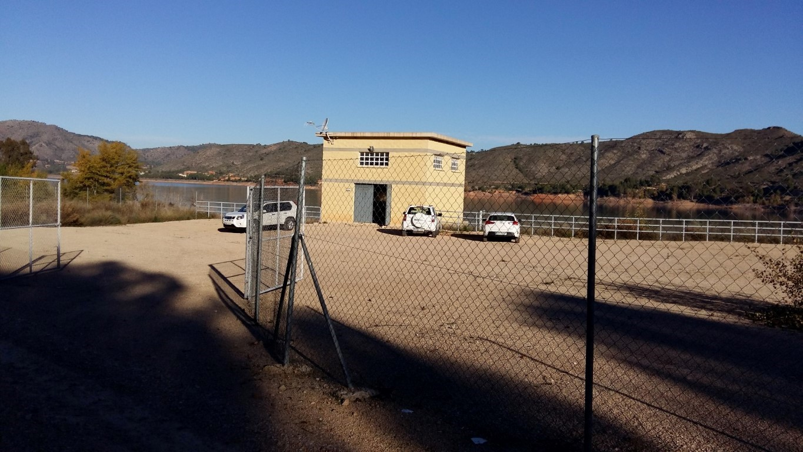
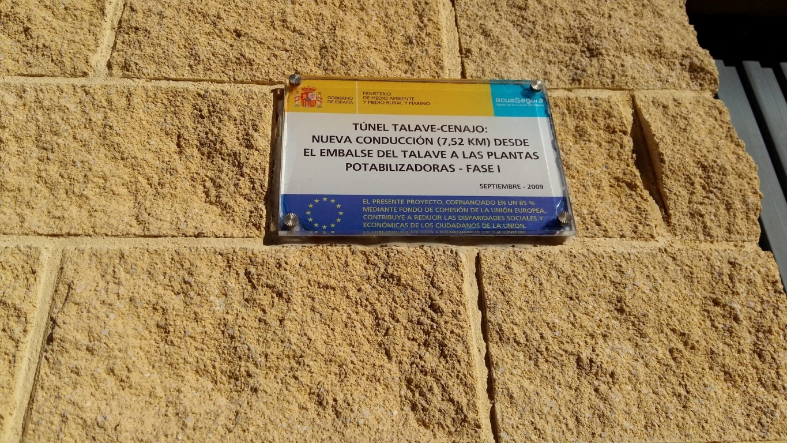

# FOTOGRAFÍAS  \label{fotos}

Se muestran fotografías de las actuaciones, tanto durante las obras como de las visitas realizadas en fase de  explotación.

## imagenes 1

```{r out.width = "30%"}


```

## imagenes 2

```{r out.width = "50%"}


```

## OTROS TRUCOS

Insertar todas las imagenes de una carpeta, se usa el ancho para configurar la matriz de imagenespor ejemplo poniendo `out.width="30%"`

```{r echo = TRUE, out.width="30%"}
# pintamos todas las imagenes
library(knitr)
myimages<-list.files("imag/", pattern = ".jpg", full.names = TRUE)
include_graphics(myimages)

```

 
