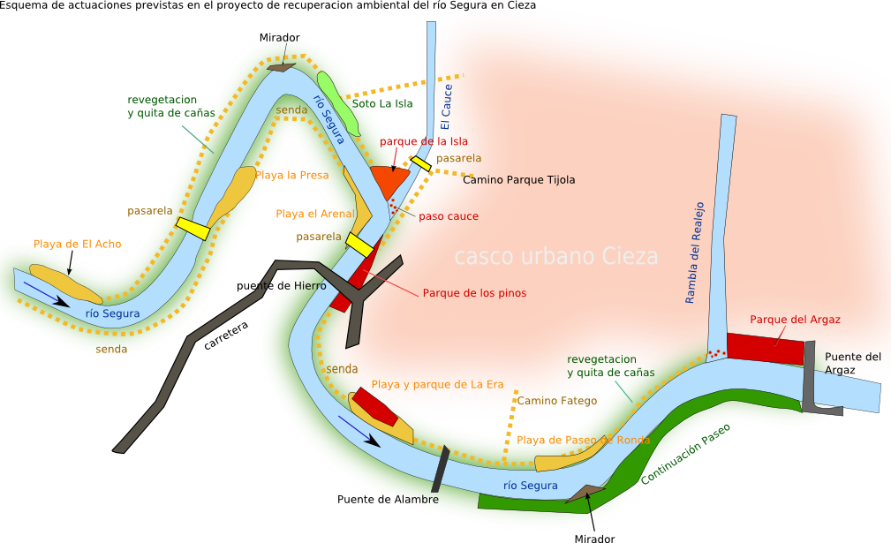

--- 
title: "Plantilla para informe en pdf"
author: "FVB"
header-includes:
- \usepackage[utf8]{inputenc}
- \usepackage{graphicx}
- \usepackage[labelfont=bf]{caption}
- \usepackage{float}
- \usepackage{fancyhdr}
- \usepackage{fancyheadings}
- \pagestyle{fancy}
- \lhead{{\scriptsize C/ Montijo, 2, 3ª planta\\ -30001 Murcia-\\Tel. 968 355 337 - Fax.
  968 22 23 25\\ \textit{\scriptsize www.acuamed.es }}}
- \chead{}
- \rhead{\includegraphics[height=0.1\textwidth]{logo1.jpg}}
- \lfoot{\scriptsize -Informe obras- }{\scriptsize}
- \cfoot{}
- \rfoot{\thepage}
lang: es
papersize: a4
fontsize: 10pt
classoption: oneside
geometry: 
- tmargin = 2 cm
- bmargin= 3 cm
- lmargin= 2.5 cm
- rmargin= 2 cm
linkcolor: blue
urlcolor: blue
citecolor: red
output: 
  pdf_document: 
    number_sections: yes
    toc: yes
    toc_depth: 2
    lot: yes
    lof: yes
documentclass: article
bibliography: [libros.bib,packages.bib]
biblio-style: apalike
link-citations: true
graphics: true
mainfont: "Calibri"
monofont: "Source Code Pro"
monofontoptions: "Scale=0.7"
---
<!-- pag sin encabezado para TOC -->
<!--\begin{titlepage}    \tableofcontents \end{titlepage}-->

<!-- pag sin encabezado para TOC de figuras -->

\pagebreak


\begin{titlepage}
    \begin{scriptsize} 
        \listoffigures
    \end{scriptsize} 
\end{titlepage}


\pagebreak

```{r setup, include=FALSE}
knitr::opts_chunk$set(echo = FALSE, message = FALSE, warning = FALSE)
```

\break
$$\\*$$


# INSTRUCCIONES 

```{r fig.align='center', echo=FALSE, include=identical(knitr:::pandoc_to(), 'html'), fig.link='https://www.gritos.org'}
knitr::include_graphics('imag/portada.png', dpi = NA)
```

Para duplicar en otro informe esta plantilla que genera un documento en pdf tipo informe hay que realizar el siguiente proceso:

 1. copiar el directorio completo con todos sus archivos en otra ubicación.
 1. cambiar de nombre a la nueva carpeta. 
 1. abrir RSTUDIO y abrir nuevo proyecto --> carpeta existente y seleccionar la carpeta renombrada en el punto anterior
 1. continuar y crear nuevo proyecto en ese carpeta en una nueva sesión
 1. RSTUDIO creará un nuevo fichero `nombre_carpeta.Rproj` que es el nuevo proyecto.
 1. modificar los ficheros de configuracion para cambiar titulos etc..
    1. el fichero `_bookdown.yml` sirve para asignar el idioma y nombres de equivalencia
    2. el fichero `_output.yml` indica el formato de salida y sus opciones (pdf en este caso)
 1. cada fichero *.Rmd se compilará para el libro o informe final como un capitulo del pdf, por orden alfabetico de su nombre.
 2. podemos añadir cuanto s*.Rmd queramos comenzando.
 3. el fichero ìndex.Rmd`es el principal que inicia el proceso de complilación y en el que se pueden incluir encabezados tipo YAML como el título, autor etc.
 4. una vez completo el documento o para ver la salida hay que ejecutar la orden siguiente en la linea de comandos de R:
    `bookdown::render_book('index.Rmd', 'bookdown::pdf_book')` incluso se pueden pasar ordenes como: `bookdown::render_book('index.Rmd', bookdown::pdf_book(keep_tex = TRUE))`
 
## Instalación de bookdown

Para usar esta plantilla debes tener la libraría `bookdown` instalada en R y el programa RSTUDIO.

Para instalar el paquete haremos: `install.packages("bookdown")`

## Enlaces internos y entre documentos \label{enlaces}

Los enlaces internos en el mismo documento se deben hacer con formato $LaTeX$ y no con markdown. Ejemplos:
    
 - para poner el enlace a una parte del documento debemos escribir esto ` \label{enlaces}` y para crear la referencia a dicho enlace esto otro: (ver Fig:\ref{fig_9}).




Por ejemplo enlaces a los capitulos principales :

 - descripcion {\@ref(des)}
 - cronología {\@ref(crono)}
 - bibliografía {\@ref(ref)}

Para ir a la documentación ir a enlace {\@ref(doc)}.

También se pueden hacer referencias a elementos como una tabla, ver los datos en la tabla \@ref(tab:aTable))  o  {\@ref(tab:aTable)}.

```{r, aTable, echo = FALSE}
knitr::kable(
  cars[1:5, ],
  caption  = "See Section \\ref{enlaces}."
  )
```

## Encabezado yaml \label{yaml1}
La informacion de los tipos de cosas que se pueden poner en yml está en <http://pandoc.org/MANUAL.html#variables-for-latex>


```{r eval=FALSE}
bookdown::pdf_book:
  includes:
    in_header: latex/preamble.tex
    before_body: latex/before_body.tex
    after_body: latex/after_body.tex
  keep_tex: no
  dev: "cairo_pdf"
  latex_engine: xelatex
  citation_package: natbib
  template: null
  pandoc_args: --top-level-division=chapter
  toc_depth: 3
  toc_unnumbered: no
  toc_appendix: yes
```


## Bibliografía \label{bib}
las referencias a libros que esten en la bibliografia deben meterse primero la ficha en los ficheros de bibliografía como `libros.bib`, y una vez esten en esa ficha basta con hacer el siguiente enlace para que aparezcan en la pagina de referencias:

Este libro ha sido escrito en R, si quieres iniciarte en R mira [@R-Fer].
Si quieres aprender Knitr lee [@R-knitr]


Es
```{block2, type='flushright', html.tag='p'}
Vilber 
Murcia, España
```
